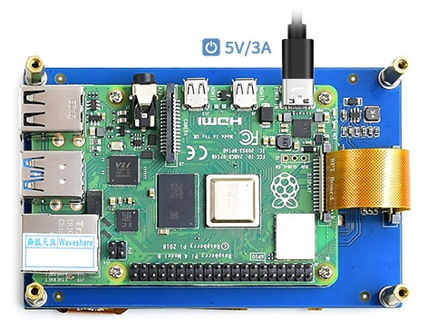

# Hardware

[Return to Home](index.md)

For the hardware, I went with:

- Raspberry Pi 4 model B 4GB RAM - [Buy on Amazon](https://www.amazon.nl/dp/B09TTNF8BT?tag=pinest-20)
- Raspberry Pi 4 USB-C Power Supply EU Plug - [Buy on Amazon]()
- 5-inch DSI Touchscreen Display (800 × 480) - [Buy on Amazon]()
- 3D printed casing

I picked the 4 GB RAM version of the Pi 4 because I’m running everything in Docker containers, and I was worried that anything less might not handle all the features I'm adding.

> **Oops Moment**: I didn’t realize the Raspberry Pi doesn’t come with internal storage for the OS. Yeah, I forgot the SD card! If you're buying a Pi, make sure you add one to your cart.

I found a 5-inch capacitive touch screen from Waveshare after searching for a while (most were resistive, which I didn’t want). The best part is that it's driverless, so no extra setup is needed to get it working with the Pi. I'll dive more into the details in the [Software](software.md) section.

## Hardware setup

With the Raspberry Pi 4B, you can mount it directly to the back of the screen and connect everything easily. Just use the short FFC cable to hook the Pi into the 15-pin DSI interface on the Pi board, like this:

For mounting, I'll use the copper columns that came with the screen, inside a custom 3D printed case.

## Casing

I'm designing my own case and printing it with a 3D printer. It’s my first time doing anything like this, so... wish me luck! I’ll let you know how it turns out.