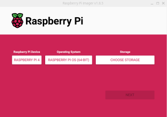
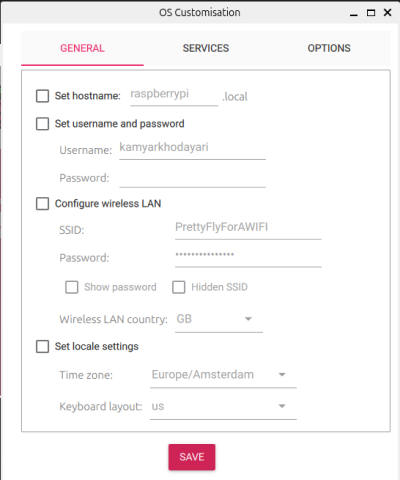
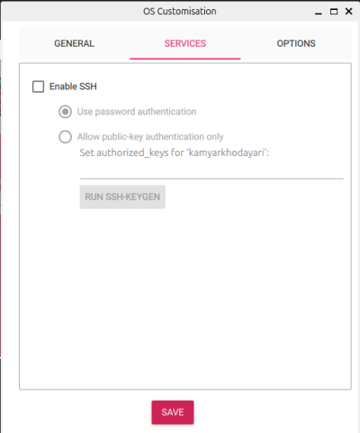
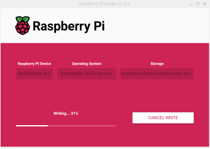
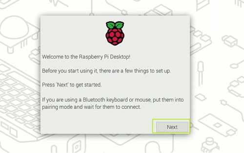

# Installing Raspberry Pi OS

[Return to Software](index.md)

First things first, you need to install an operating system on your Pi. And for that, you'll need a microSD card.

1. **Download and install Raspberry Pi Imager on your PC**  
   Raspberry Pi Imager makes it super easy to install Raspberry Pi OS (or other OS options) onto your microSD card, so it's ready to go with your Pi.

2. **Connect your microSD card to the PC**  
   Open up Raspberry Pi Imager, choose your Pi model (Raspberry Pi 4 in this case), select your OS (I'm going with Raspberry Pi OS 64-bit), and choose your storage (the microSD card you just plugged in).

   

   Click "NEXT," and you’ll see this popup:

   

   Since we want SSH access on the Pi, hit "EDIT SETTINGS." You’ll see this screen:

   

   In the "GENERAL" tab, enable "Configure Wireless LAN" and enter the correct SSID and password to connect your Raspberry Pi to your WiFi network. Make sure to leave the "Set username and password" option disabled so that you can go through the setup wizard during the first boot. After that, navigate to the "SERVICES" tab.

   

   Here, you can enable SSH. I recommend selecting "Allow public key authentication only" and adding your public key. You can follow [this guide](https://docs.github.com/en/authentication/connecting-to-github-with-ssh/generating-a-new-ssh-key-and-adding-it-to-the-ssh-agent) if you don’t have one yet.

   After making all your changes, hit "SAVE" to apply them. You’ll be taken back to the popup where you originally clicked "EDIT SETTINGS." At this point, it will ask you, **"Would you like to apply OS customization settings?"** Hit "YES" to confirm.

   Now, the Imager will start writing the data to your microSD card.

   

   Once it’s done, the Imager will let you know, and you can safely eject the microSD card.

3. **Insert the microSD card into the Pi**  
   Pop the microSD card into your Raspberry Pi and set up the 5-inch display.

   For more details on getting the display set up, head over to the [Hardware](../hardware.md) section.
      
   When you're ready, plug your Pi into power using the USB-C adapter. Make sure you’ve got a mouse and keyboard handy to go through the setup wizard. After a bit, you should see the screen pop up on your touchscreen display connected to the Pi.

   

   The setup wizard is easy to follow. You can also connect a Bluetooth mouse or keyboard to get through it if needed. You'll start by setting your country, language, and timezone. Then, you'll create a user with a username and password—don’t forget that username because you might need it later for SSH access.

   Next up, you’ll be prompted to set up WiFi, but since you've already configured it through the Imager, you can just skip that step. If you're asked to enable Raspberry Pi Connect, go ahead and do it—this will let you access your Pi remotely later.

   As the last step, you’ll update the software and reboot your Pi. After the reboot, you should see the desktop environment of your new OS. That’s it—everything's ready!

Next up, let’s connect to our Pi using Pi Connect the first time! Head over to [Connecting to the Pi](./pi-connect.md) to keep going.